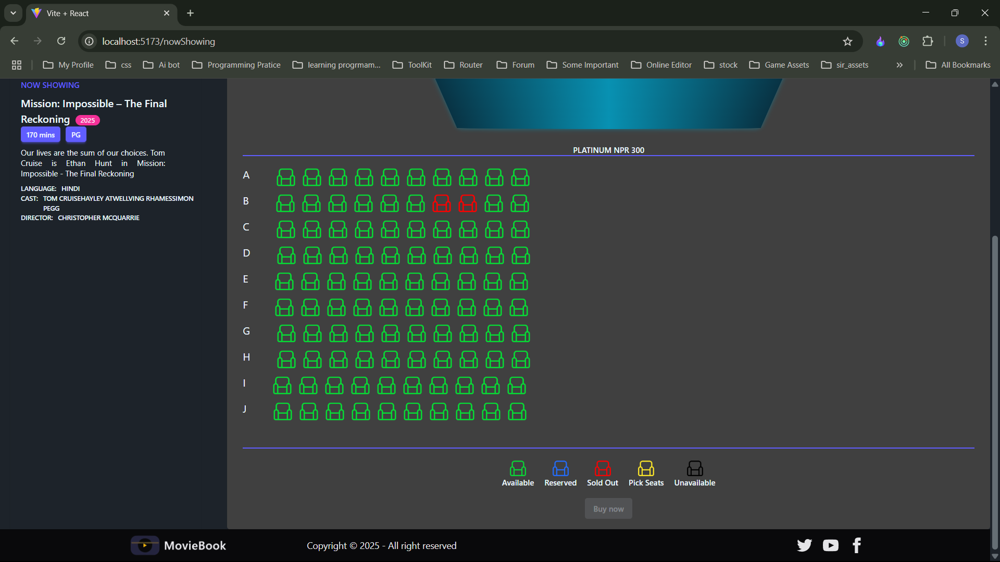

# Online Movie Booking System

A comprehensive online movie ticket booking application built with modern web technologies, allowing users to browse movies, select showtimes, choose seats, and complete payments through multiple gateways.


## 🚀 Technologies Used

- **Frontend**: React.js
- **State Management**: Redux
- **CSS Framework**: Tailwind CSS
- **UI Components**: Daisy UI
- **Payment Integration**: Stripe, Esewa, Khalti

## ✨ Features
- User authentication (login/signup)
- Browse movies and showtimes
- Date and time selection
- Interactive seat selection
- Multiple payment gateways
- Email notifications
- Ticket confirmation
- Admin panel for cinema management
- Moderator tools for show management

## 📸 Screenshots

<details>
<summary>Click to expand screenshots</summary>

### User Flow
- Login/Signup


- Homepage Experience


- Movie Selection


- Date Selection 


- Seat Selection

- Payment Process


- Ticket Confirmation


### Admin Features
- Cinema Management


- User Management


### Moderator Features
- Movie Management

- Show Management

- Schedule Management

</details>

## 🛠️ Installation

1. Clone the repository
    ```
    git clone https://github.com/yourusername/online-movie-booking.git
    ```

2. Install dependencies
    ```
    cd online-movie-booking
    npm install
    ```

3. Start the development server
    ```
    npm start
    ```

## 🔑 Test Credentials

### Customer
- **Email**: Custumer@gmail.com
- **Password**: custumer

### Admin
- **Email**: admin@gmail.com
- **Password**: admin

### Moderator
- **Email**: moderator@gmail.com
- **Password**: moderator

## 💡 Usage

1. **For Customers**:
    - Browse and filter movies
    - Select show date and time
    - Choose preferred seats
    - Complete payment
    - Receive ticket confirmation via email

2. **For Admins**:
    - Manage cinemas and theaters
    - Manage Role 
    - Control user access

3. **For Moderators**:
    - Add/edit movie listings
    - Manage show schedules
    - Monitor booking status

## 🤝 Contributing

Contributions, issues, and feature requests are welcome! Feel free to check [issues page](https://github.com/Saroj-kr-tharu/online-movie-booking/issues).

## 📝 License

This project is [MIT](https://opensource.org/licenses/MIT) licensed.

## 🙏 Acknowledgements

- All the contributors and team members
- Open-source libraries used in this project